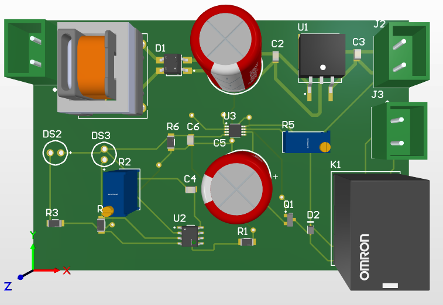

# Infrared Proximity Relay Switch with Onboard Power Supply & Timer Control

A complete, single-sided hardware design integrating power electronics, analog sensing, and timing control—designed entirely from scratch using **Altium Designer**.

## 🚀 Project Overview
This hardware prototype integrates multiple functional electronic blocks onto a single, compact, single-sided printed circuit board (PCB):
1. **Mains Power Stage:** Step-down transformer, bridge rectifier, and an MC7805 regulated 5V output.
2. **Sensing Stage:** Infrared proximity sensor driven by an LM358 operational amplifier.
3. **Control & Switching Stage:** LMC555 timer circuit paired with an electromechanical relay for precise load switching.

---

## 🛠️ Key Technical Specifications
* **Design Tool:** Altium Designer
* **Input Voltage:** 230V AC (Step-down via transformer to 9V AC, regulated to 5V DC)
* **Active Components:** MC7805 (Voltage Regulator), LM358 (Operational Amplifier), LMC555 (Timer IC), BC847 (Transistor), and an Omron Electromechanical Relay.
* **PCB Type:** Single-sided layout focusing on clean trace routing and Design Rule Check (DRC) compliance.

---

## 📷 Circuit Preview

---

## 📂 Repository Contents
* `Hardware/Altium_Project/`: Source files for schematic capture and PCB layout.
* `Hardware/Outputs/`: Gerber and manufacturing files.
* `Documentation/`: Exported schematics and design references.
